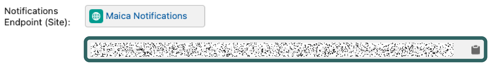

# Stripe Integration

## How do I integrate with Stripe within Maica?&#x20;

To learn how to configure the Stripe integration in Maica, please follow the steps detailed below.&#x20;

### 1. Assign Stripe API Keys&#x20;

To begin configuring your Stripe Integration, go to the `Maica Settings` tab in the Menu bar. When there, select the `Payment Management` tab to see the following.

<figure><figcaption></figcaption></figure>

There are three fields that are required to be populated, these are:&#x20;

* Stripe Publishable Key&#x20;
* Stripe Secret Key&#x20;
* Stripe Webhook Secret&#x20;


These keys are taken directly from Stripe, to learn more about Stripes API Keys and how to access them in Stripe, click [here](https://docs.stripe.com/keys#obtain-api-keys).&#x20;


### 2. Connect Site (Notifications Endpoint)&#x20;

Finally, all that is left to do is connect your `Site`. Select your `Site` from the dropdown field and click `Save` to finalise your set up.&#x20;


To learn more about how to configure a`Site` in **Salesforce** and why they are important, click [here](create-a-site.md).&#x20;


### 3. Setup Endpoints for Webhooks&#x20;

Once you have populated the fields above and connected your **Site**, you need to configure the required `Webhooks` on **Stripe**.&#x20;

You do this by heading to Stripe, searching for `Developers` and selecting the `Webhooks` tab.

Once there, select the `+ Add Endpoint` button located in the top right hand corner of your interface.&#x20;

Here you will prompted by Stripe to add an Endpoint URL and Description. The Description is optional however the Endpoint URL is required.&#x20;


The Endpoint URL is located in the Payment Management tab of the Maica Settings, as shown below. You can simply copy this directly into **Stripe**.&#x20;


<figure><figcaption></figcaption></figure>

After you have populated **Stripe** with the Endpoint URL, you need to select the Events you want your Endpoint to listen to.&#x20;


Ensure `Events on your account` is selected.&#x20;


**Stripe** will provide a large list of possible Events, the crucial ones to select for the **Stripe** Integration with **Maica** are the:&#x20;

* `invoice.payment_failed`&#x20;
* `invoice.payment_succeeded`&#x20;

You can find these by simply searching in the `Search Events` bar at the top of the page. Once done, select `Add Events`, and then finalise your Endpoint by clicking `Add Endpoint`.&#x20;

