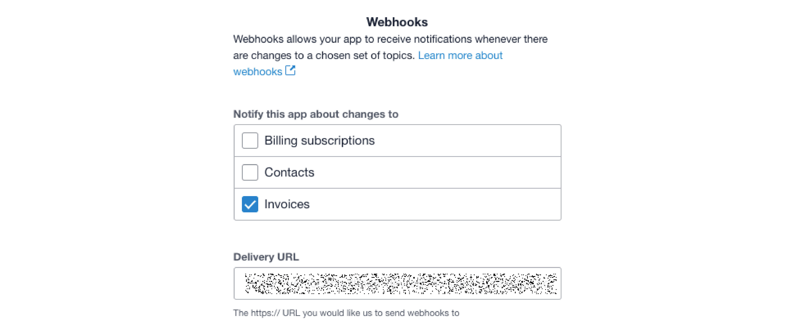

# Xero Integration

## How do I integrate with Xero within Maica?&#x20;

To learn how to configure the Xero integration in Maica, please follow the steps detailed below.&#x20;


Please note that whilst completing the integration within Maica, there are further pointers and steps to assist you. This article breaks these steps down further and into more detail, hence the step numbers seen here and within Maica may vary.


To begin configuring your Xero Integration, go to the `Maica Settings` tab in the Menu bar. When there, select the `Xero Management` tab to see the following.

<figure><figcaption></figcaption></figure>

Here, we can see the [`Active Connections`](./#active-connections) and [`Webhooks`](./#webhooks) sections. To complete the Xero Integration, we must first set up both of these areas.

Before proceeding, make sure that the Xero Management toggle in the top right corner of your interface is set to `Enabled`, as shown below.

<figure><figcaption></figcaption></figure>

## Active Connections

### 1. Begin Adding a `New Xero Connection`&#x20;

The first section to complete is the Active Connections section. You can now begin to do so by adding a new Xero Connection by simply clicking the `+ Add New Xero Connection` button within the `Active Connections` section, as shown below.&#x20;

<figure><figcaption></figcaption></figure>

Once clicked, the following Xero OAuth Connection Setup pop-up will be displayed.&#x20;

<figure><figcaption></figcaption></figure>


For privacy reasons, the `Company or Application URL` and `Redirect URI` have been obscured; however, they will be visible and pre-populated in your organisation.


### 2. Create a custom Web App

Using the links above, you can now create a custom Xero Web App. To do so, follow the link shown in the above image (or here: [developer.xero.com](https://developer.xero.com/app/manage)). Once on the link, you will be presented with the following screen:&#x20;

<figure><figcaption></figcaption></figure>

Here, you can add a Custom Name for you App, and then copy and paste the `Company or Application URL` and `Redirect URI` from **Maica** into the related input fields on Xero. Once done, check the Terms & Conditions box and click `Create App`.&#x20;


Make sure your Integration Type is set to Web App. It should be selected by default.&#x20;


### 3. Import Web App Identification Codes

Once you have created your Web App, head to the `Configuration` tab on the left hand side of Xero interface. There, you will see the following:&#x20;

<figure><figcaption></figcaption></figure>

Click `Generate a secret`, and then copy both the `Client ID` and `Client Secret` back into the relevant fields within **Maica**. These fields are shown in `Xero OAuth Connection Window` screenshot in Step 1 of this article.&#x20;

### 4. Confirm Redirect URI configuration&#x20;

Before proceeding any further, confirm the `Redirect URI` shown in Maica matches that of the `Redirect URI` on the `Configuration` page within Xero (the above page). If they do, it has been configured correctly and you can proceed to the next step, if not, copy the `Redirect URI` from **Maica** and paste it into the field in **Xero**.&#x20;

Once you have completed Steps 1, 2 and 3, click the `Save` button in the bottom right hand corner of the interface. This will trigger the creation of a Manage Xero Permission Set and create Named Credential Records required to finish the remaining set up steps of the Integration. Once saved, the Xero OAuth Connection Setup module on Maica will dynamically update, displaying the final remaining stages. Simply reopen it after saving to view these steps.

### 5. Actions to the Named Credential Record&#x20;

As mentioned above, when creating a connection with Xero, Maica will create an associated Credential Record.


To learn about Credential Records in Salesforce, click [here](https://help.salesforce.com/s/articleView?id=sf.nc_basics.htm\&type=5).&#x20;


Two actions are required on the Credential Record, these include:&#x20;

1. `Enable for Callouts` toggle = `TRUE`&#x20;
2. `maica_cc` to be added as a value to the `Allowed Namespaces for Callouts` field

To complete the above actions, first click the hyperlink to the Named Credential record in the Xero OAuth Connection Setup pop-up.&#x20;

This will open up the Named Credential record where the specified actions can be completed, as shown below.&#x20;

<figure><figcaption></figcaption></figure>


Note, The `Created By Namespace` field shows which **managed package** a component belongs to. This field is automatically populated by Salesforce and reflects Maica’s managed package namespace (**maica\_cc**). It does not require any action.


Once done, click `Save` and move onto the next step.&#x20;

### 6. Assign Users to the Created Permission Set

As also mentioned above, when creating a connection with Xero, Maica creates a Permission Set. Maica will automatically assign it to the current user, however you can assign all necessary users you desire to access the Xero Connection.&#x20;

To begin, click the hyperlink to the Permission Set in the Xero OAuth Connection Setup pop-up, as shown below.&#x20;

<figure><figcaption></figcaption></figure>

This will open up the Permission Set. Once open, click the Manage Assignments button in the menu in order to add additional users to the Set, as shown below.&#x20;

<figure><figcaption></figcaption></figure>

Then, click the Add Assignments button in the top right hand corner of your interface, and select the checkbox for all Users you wish to assign the Permission Set to. Once done, click `Next`.&#x20;

After clicking the Next button, **Maica** will take you to a summary screen of your selected Users where you can set an expiration option if desired. This allows for the ability to set a date in which the Permission to the specified Users will expire, as shown below.&#x20;

<figure><figcaption></figcaption></figure>


By default, Permission Set assignments never expire.


To finalise your assignments, click the `Assign` button in the bottom right hand corner of your interface. Once done, an Assignment Summary page will show with a Success Status by each Assigned User.&#x20;

<figure><figcaption></figcaption></figure>

### 7. Authenticate

Once completed, you can click the `Authenticate` button to finalise the Connection.&#x20;


If Step 5 or Step 6 are not available in the Xero OAuth Connection Setup, you may need Authenticate prior to completing them. If so, simply navigate back to the Xero Management Settings and complete these steps after Authenticating. Do not Authenticate again in this instance, once the steps are done, simply close the window.&#x20;


## Webhooks

### 1. Add a Notifications Endpoint (Site)

The second section to complete is the Webhooks section. You can now begin to do so by first populating the Site field with your configured Site.&#x20;


To learn how to configure a Site, click [here](../create-a-site.md).&#x20;



Please make sure the associated Guest User of the selected Site has Handle Xero Notifications permission set assigned.


### 2. Link to Xero

Once you have selected your `Site`, **Maica** will generate a URL that will be used to connect back with Xero. Copy the URL from Maica and open your previously created Xero Web App. On the side menu bar of the Web App, navigate to the Webhooks section and paste the URL in the Delivery URL field, as shown below.&#x20;

<figure><figcaption></figcaption></figure>


Maica is only connected to the Invoices webhook, so ensure that this is the only option ticked from the `Notify this app about changes to` options.


### 3. Return Webhooks Key to Maica

Finally, from Xero, copy the Webhooks Key shown under the the Delivery URL and paste back into the Webhooks Key field in Maica, as shown below:&#x20;

<figure><figcaption></figcaption></figure>

<figure><figcaption></figcaption></figure>

Test the Status in **Xero** to ensure that the process has been completed and is configured properly, then click `Save` within **Maica** to begin receiving Invoice Notifications.&#x20;


Once you have finished setting up the Connection and Webhook, it is essential that you configure your [Support Items](support-item-configuration.md) in order to facilitate the integration. The integration will fail if the associated [Support Items](support-item-configuration.md) are not also configured. Please see the linked article to learn how to do this.&#x20;


## How do I removed my Xero Connection and establish a new one?&#x20;

In order to establish a completely new Xero connection within **Maica**, you first must remove the following:&#x20;

1. The Named Credential&#x20;
2. The External Credential&#x20;
3. The Xero Authentication Provider record

To do so, re click the `+ Add New Xero Connection` button in the `Active Connections` section, and follow the hyperlinks within **Maica**, as shown below.&#x20;

<figure><figcaption></figcaption></figure>

When you click on each link, the corresponding record will open. Simply delete the record and repeat the process for all three before attempting to establish a Xero new connection.
