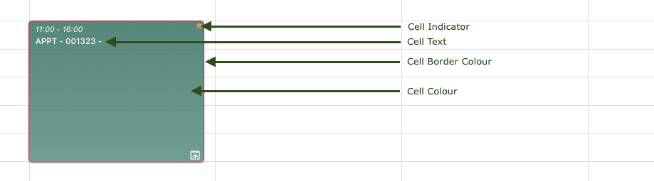

# Planner Management

These settings determine how Maica manages the Planner and its function throughout the application. Please refer below for more information on each setting:&#x20;


Please note, the below settings can be applied to both Appointments and Shift separately and these will render in the Maica Planner in accordance with how they have been defined for either.


### Text Format

Please refer to the below table for more information on each setting:&#x20;

<table><thead><tr><th width="222">Setting</th><th>Description</th></tr></thead><tbody><tr><td><code>Text Format</code></td><td>
The Maica Planner allows you to specify what text appears in the cells of either an Appointment or a Shift. 

This settings defines this by using a formula-based approach in which you can configure exactly what you want the text to be. This includes the merging of record attributes as well as your own text.
</td></tr></tbody></table>

### Unavailability Text Format&#x20;

The **Unavailability Text Format** section controls the label displayed on Unavailability tiles. Previously, Unavailability tiles had no label by default. This setting allows you to choose whether and how Unavailability tiles are labelled, with separate configuration per Planner View.

#### Where to find it

In Maica Settings, open **Planner Management** and select either the **Appointments** or **Shifts** tab. The **Unavailability** section appears below the existing **Text Format** section.&#x20;

#### Configuring the Text Format dropdown

The **Text Format** dropdown offers three options:

* **(do not format)**: the default for new and upgraded organisations. Unavailability tiles display with no label, preserving the existing behaviour.
* **{Resource Name} : {Unavailability Type}**: a system-provided merge-field format. Each Unavailability tile displays the Resource Name and the Unavailability Type, separated by a colon.
* **Other**: a custom format you build yourself using the Insert Field tool.

When **Other** is selected, a text input appears alongside an **Insert Field** button. Click **Insert Field** to add merge fields from the Unavailability record or its related records. The Insert Field tool behaves identically to the one already used for **Text Format**, so administrators familiar with one will find the other immediately usable.


If **Other** is selected but the text input is left blank, Unavailability tiles continue to display with no label, matching the **(do not format)** behaviour. This means switching to **Other** without entering a format does not cause any visual change until a format is saved.


#### Per-Planner-View configuration

The Appointments tab supports four Planner Views: **Schedule**, **Participant**, **Asset**, and **Accommodation**.&#x20;

The Shifts tab supports three Planner Views: **Schedule**, **Roster**, and **Shift**.


Appointments-tab and Shifts-tab Unavailability formats are fully independent. Configuring one does not change the other. This allows organisations that use different Unavailability semantics across Appointment and Shift workflows to label tiles appropriately for each context.


### Appearance Settings

The Maica Planner allows for a variety of configuration options including colour branding and appearance as shown in the below screenshot.

<figure><figcaption>
A typical Appointmnent/Shift
</figcaption></figure>

Please refer to the below table for more information on each setting:&#x20;

<table><thead><tr><th width="222">Setting</th><th>Description</th></tr></thead><tbody><tr><td><code>Main Cell Colour</code></td><td>The Maica Planner allows you to set the cell colour based on any attribute from the Appointment/Shift (as long as this is a picklist) and then you can assign a specific colour for for each value.  <em>An example might be using an attribute called <code>Status</code> and then assigning a specific colour to each possible value of the <code>Status</code> such <code>Planned</code> or <code>Scheduled</code>.</em></td></tr><tr><td><code>Cell Indicator Colour</code></td><td>The Maica Planner allows you to set the cell indicator based on any attribute from the Appointment/Shift (as long as this is a picklist) and then you can assign a specific colour for for each value.  <em>An example might be using an attribute called <code>Status</code> and then assigning a specific colour to each possible value of the <code>Status</code> such <code>Planned</code> or <code>Scheduled</code>.</em></td></tr><tr><td><code>Shift Colour</code></td><td>This is the cell colour used to show Shifts within the Planner Schedule and Participant views.</td></tr><tr><td><code>Unavailability Colour</code></td><td>Maica allows Resources to record Unavailability and this setting defines what colour these Unavailability records are shown in.</td></tr><tr><td><code>Unfilled Appointment Colour</code></td><td>Maica considers an Appointment to be unfilled when either the number of Participants or the number of Resources is less than the Ratio specified. This setting specifies the cell border colour of Appointments that are marked as <code>unfilled</code>.</td></tr><tr><td><code>Cell Border Colour</code></td><td>This is the cell border colour used to show Appointments within the Planner Schedule and Participant views.</td></tr><tr><td><code>Cell Border Radius</code></td><td>The Maica Planner allows you to specify the width of the radius of each Appointment cell. This setting specifies the width of the radius from no radius (set to 0) to any desired width (set to greater than 0).</td></tr></tbody></table>

### Other Settings

Please refer to the below table for more information on each 'Other' Setting:&#x20;

<table><thead><tr><th width="222">Setting</th><th>Description</th></tr></thead><tbody><tr><td><code>Field to be shown as the Participant Name</code></td><td>
In the Maica Participant View (when selecting Timeline), all your active Participants are shown on the left had side of the Planner. 

 This setting allows you to select an attribute from the Participant (Contact) profile to display as a replacement of the name of the Participant.
</td></tr><tr><td><code>Field to be shown as the Resource Name: Appointment</code></td><td>
In the Maica Schedule View (when selecting Timeline), all your active Resources are shown on the left had side of the Planner. 

This setting allows you to select an attribute from the Resources profile to display as a replacement of the name of the Resources.
</td></tr><tr><td><code>Field to be shown as the Asset Name</code></td><td>
In the Maica Asset View (when selecting Timeline), all your active Assets are shown on the left had side of the Planner. 

This setting allows you to select an attribute from the Asset profile to display as a replacement of the name of the Asset.
</td></tr><tr><td><code>Field to be shown as the Resource Name: Shift</code></td><td>
In the Maica Roster View (when selecting Timeline), all your active Resources are shown on the left had side of the Planner. 

This setting allows you to select an attribute from the Resources profile to display as a replacement of the name of the Resources.
</td></tr><tr><td><code>Field to be shown as the Shift Name</code></td><td>
In the Maica Shift View (when selecting Timeline), all your active Shifts are shown on the left had side of the Planner. 

This setting allows you to select an attribute from the Shift record to display as a replacement of the name of the Shift.
</td></tr><tr><td><code>Field to be shown below the Participant Name</code></td><td>
In the Maica Participant View (when selecting Timeline), all your active Participants are shown on the left had side of the Planner. 

This setting allows you to select an attribute from the Participant (Contact) profile to display below the name of the Participant.
</td></tr><tr><td><code>Field to be shown below the Resource Name: Appointment</code></td><td>
In the Maica Schedule View (when selecting Timeline), all your active Resources are shown on the left had side of the Planner. 

This setting allows you to select an attribute from the Resources profile to display below the name of the Resources.
</td></tr><tr><td><code>Field to be shown below the Asset Name</code></td><td>
In the Maica Asset View (when selecting Timeline), all your active Assets (Non-Human Resources) are shown on the left had side of the Planner. 

This setting allows you to select an attribute from the Resources profile to display below the name of the Resources.
</td></tr><tr><td><code>Field to be shown below the Resource Name: Shift</code></td><td>
In the Maica Roster View (when selecting Timeline), all your active Resources are shown on the left had side of the Planner. 

This setting allows you to select an attribute from the Resources profile to display below the name of the Resources.
</td></tr><tr><td><code>Field to be shown below the Shift Name</code></td><td>
In the Maica Shift View (when selecting Timeline), all your active Shifts are shown on the left had side of the Planner. 

This setting allows you to select an attribute from the Shift record to display below the name of the Shift.
</td></tr><tr><td><code>Quick Information Dialog Fields</code></td><td>
The Quick Information Dialog in an interactive component that allows you to quickly engage with an Appointment or Shift without having to open the management console. 

This setting determines what attributes (fields) are shown on this Quick Information Dialog when single-clicking on an Appointment or Shift.

</td></tr><tr><td><code>Quick Information Dialog Actions</code></td><td>This setting determines what actions (such as Check-in) are shown on this Quick Information Dialog when single-clicking on an Appointment or Shift.</td></tr></tbody></table>

### Shared Settings

Please refer to the below table for more information on each Shared Setting:&#x20;

<table><thead><tr><th width="222">Setting</th><th>Description</th></tr></thead><tbody><tr><td><code>Snap Size</code></td><td>This setting allows you to set the number of minutes that an Appointment or Shift is moved when dragging.   <em>An example might be setting this to <code>15</code> which means everytime an Appointment or Shift is dragged on the Planner, it is moved by 15 minutes.</em></td></tr><tr><td><code>Available Views</code></td><td>This setting specifies which Planner Views (like Schedule, Participant, or Shift) you would like your users to have access to.   <em>For example, if your organisation does not manage Shifts, then simply turn the Shift and Roster view off.</em></td></tr><tr><td><code>Unfilled Section Position</code></td><td>The Maica Planner shows a dedicated row for any Appointments or Shifts that are unfilled or unassigned. This setting determines whether this row is shown at the top of the Planner (in Timeline view), at the bottom or not at all</td></tr><tr><td><code>Timeline</code></td><td>This settings defines what time duration should be shown on the Planner, for example if 9am - 5pm is selected, then the Planner will render only these times.  <em>Use this setting to effectively represent your organisational working hours to be shown in the Planner.</em></td></tr><tr><td><code>Start Day of Week</code></td><td>Choose which day begins each week in the Planner Calendar view. This setting affects how weekly and fortnightly schedules are displayed and when users navigate between time periods using the date picker.</td></tr><tr><td><code>Block Unavailability</code></td><td>Maica is able to either allow Appointments to be created when they overlap with a Resource's Unavailability or to block this from happening.   This setting defines how Maica will behave when an Appointment is created during an Unavailability for any associated Resource.</td></tr><tr><td><code>Include Travel Time in Appointments</code></td><td>When rendering Appointments or Shifts in the Maica Planner, it is possible to either include the travel time into the Appointment or not.  <em>For example, your Appointment might be 60 minutes long with 30 minutes travel time. Depending on this setting, the Appointment is either shown as 60 minutes (if travel time is not shown) or as 90 minutes (if travel time is shown).</em></td></tr><tr><td><code>Cascade Look</code></td><td>The Maica Planner can render a number of overlapping Appointments either as sitting side by side or by cascading them on top of each other.   This setting determines how the Maica Planner renders overlapping Appointments/Shifts.</td></tr><tr><td><code>Quick Information Dialog vs Tooltip</code></td><td>This determines whether the Maica Planner shows a tooltip when hovering over an Appointment/Shift or the Quick Information Dialog is shown instead.</td></tr></tbody></table>
