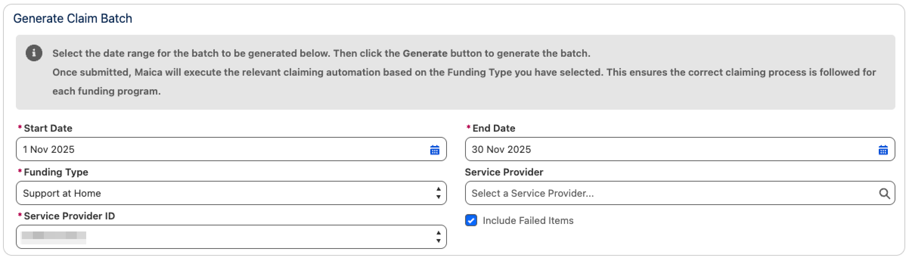
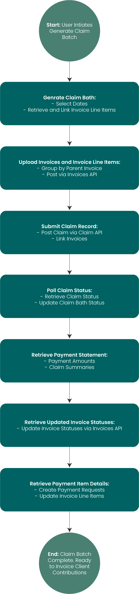

# Claiming Process

## Claiming Overview

In Maica, the **Support at Home Claim Submission** process enables you to generate and submit claim batches to **Services Australia**, retrieve the status of your claims, and automatically update your invoices and budgets based on the response received.

***

## Purpose

The **Support at Home Claim Submission** process is designed to:

* Generate a **claim batch** for submission to **Services Australia** via API.
* Use a Quick Action to **check the claim status** after submission.
* **Update invoice and line item records** based on the claim’s final status (e.g., paid).
* Output **Payment Request records** in line with responses from Services Australia.

***

## The Process

The process is **linear** and consists of the following stages:

1. [**Generate Claim Batch and Payment Requests**](claiming-process.md#id-1.-generate-claim-batch-and-payment-requests)
2. [**Upload Invoices and Invoice Line Items** to Services Australia](claiming-process.md#id-2.-upload-invoices-and-invoice-line-items-to-services-australia)
3. [**Submit Claim Record** to Services Australia](claiming-process.md#id-3.-submit-claim-record-to-services-australia)
4. [**Use Quick Action (QA)** to retrieve Claim Status](claiming-process.md#id-4.-check-claim-status)
5. [**Retrieve Payment Statement** and update Claim Batch](claiming-process.md#id-5.-retrieve-payment-statement-and-update-claim-batch)
6. [**Retrieve Updated Invoice Statuses**](claiming-process.md#id-6.-retrieve-updated-invoice-statuses)
7. [**Retrieve Payment Item Details** for Invoice Line Items](claiming-process.md#id-7.-retrieve-payment-item-details-for-invoice-line-items)
8. [**Refresh Care Recipient Budget data**](claiming-process.md#id-8.-refresh-care-recipient-budgets)

Each stage of this process is covered in detail in this article.&#x20;


To watch a full Video Demonstration of this process, click [here](https://app.gitbook.com/s/hehRshYIRk6XUlay9L3b/support-at-home/claiming-overview#video-demonstration).&#x20;


***

### 1. Generate Claim Batch and Payment Requests

#### Purpose

Initiate a Support at Home Claim Batch by applying filter criteria to `Invoice Line Item` records. Records that meet the criteria will have `Payment Request` records generated and linked to a new Claim Batch.

***

#### User Action

The **Generate Claim Batch** quick action initiates the process, launching a modal for filter input.

***

#### UI Behaviour

The modal captures:

* **Start Date / End Date**: Defines the date range for eligible `Invoice Line Item` records.
* **Service Provider**: Multi-select lookup field.
* **Funding Type**: Picklist field.
* **Include Failed Items** – Checkbox allowing inclusion of invoice line items with a `Claim Status` of _Submission Failed_ if they fall within the selected date range.
* **Service Provider ID**: This selection determines **which invoices are eligible** for inclusion in the batch.&#x20;

The modal provides flexibility to configure submission parameters for targeted claim batch generation.

<figure><figcaption></figcaption></figure>

***

#### Service Provider ID Selection&#x20;

When generating a Claim Batch for **Support at Home**, claims are created under a specific **Service Provider ID**. This ensures invoices are grouped and submitted in the correct provider context.

During the **Generate Claim** process, you must select a **Service Provider ID**.

* The available Service Provider IDs are populated from those synced in **Support at Home Settings**.
* Only one Service Provider ID can be selected per Claim Batch.
* If no Service Provider IDs are available, you must first run [**Sync Service Providers**](care-management-budget-sync.md) in Support at Home Settings.

When a Service Provider ID is selected:

* Only invoices where the related Participant (Contact) is associated with the same **Service Provider ID** are retrieved.
* Invoices associated with Participants under other Service Provider IDs are excluded.


The selected Service Provider ID is stored on the Claim Batch record and is used for audit, reporting, and downstream processing.



If no eligible invoices exist for the selected Service Provider ID and date range, the Claim Batch is generated without invoices and a message is shown indicating that no invoices were available.


***

#### Invoice Line Item Filtering Logic

Only `Invoice Line Item` records where the related **Invoice Claim Status** is set to `Open`, `maica__Invoice_Line_Item__c`.`maica__Exclude__c` = **TRUE,** or (if the **Include Failed Items** checkbox is selected) `Submission Failed`, will be considered for inclusion in the batch.

<table><thead><tr><th width="191.42620849609375">Modal Input</th><th>Field</th><th>Notes</th></tr></thead><tbody><tr><td>Start Date &#x26; End Date</td><td><code>maica_cc__Service_Date__c</code></td><td>The service date must fall within the selected range</td></tr><tr><td>Service Provider</td><td><code>maica_cc__Invoice__r.maica_cc__Service_Provider__c</code></td><td>Must match the provider(s) selected in the modal</td></tr><tr><td>Funding Type</td><td><code>maica_cc__Invoice__r.maica_cc__Funding_Type__c</code></td><td>Must match the funding type selected in the modal</td></tr><tr><td>Include Failed Items</td><td>n/a</td><td>When selected, includes records where the related claim has <code>Claim Status = Submission Failed</code> within the defined service dates.</td></tr></tbody></table>

***

#### Payment Request Field Mapping

The table below shows how fields from the **Invoice Line Item** are mapped into the newly created **Payment Request**:

| Invoice Line Item Field | Payment Request Field            |
| ----------------------- | -------------------------------- |
| `Id`                    | `maica_cc__Invoice_Line_Item__c` |
| `maica__Amount__c`      | `maica_cc__Claimed_Amount__c`    |

#### Process Outcome

* `Invoice Line Item` records that meet the provided criteria are retrieved.
* Retrieved `Invoice Line Item` records have a `Payment Request` record generated and linked to the Claim Batch via a **Claim Batch Lookup.**
* This completes the initial generation of the claim batch.
* The **Generate Claim Batch** quick action can be launched again at any time prior to submission of the claim to **refresh** or **add additional Items** to the existing Claim Batch

***

### 2. Upload Invoices and Invoice Line Items to Services Australia

#### Purpose

Upload the generated Claim Batch Invoice and Invoice Line Item records to **Services Australia** for processing.

***

#### User Action

User clicks the **Submit Claim** button in the Quick Action

* A confirmation message is to be displayed to the user

Once done, the modal will update and alert the user that the Claim has been submitted.&#x20;

***

#### System Action

Using the **Invoices API**, Maica:

* Groups Invoice Line Item records by their parent Invoice.
* For each parent Invoice:
  * Posts a new **Invoice** record using the API POST method (mapping in the following [Google Sheet](https://docs.google.com/spreadsheets/d/1IDFI-nCkVysqpB1LA9Zclcl2nTIyn_JyHWBXM9I5Z-o/edit?usp=sharing))
  * Upon successful creation, receives a **Services Australia Invoice ID**.
  * Update the Invoice record in Maica with the following:
    * Services Australia Invoice ID = `maica_cc__Invoice__c`.`maica_cc__Aged_Care_Invoice_ID__c`
    * Invoice Closure Date (`maica_cc__Invoice__c`.`maica_cc__Invoice_Closure_Date__c`) = YESTERDAY
    * Invoice Claim Status (`maica_cc__Invoice__c`.`maica_cc__Claim_Status__c`) = SUBMITTED
    * `Original Claim Date` → `maica_cc__Invoice__c.maica_cc__Original_Claim_Date__c` = _Date Submitted_
    * `Claim Submission Error Details` → populated if the submission fails or partially
  * Posts all related **Invoice Line Items** (child records) using the retrieved Services Australia Invoice ID as the parent reference.
  * Upon successful creation, receives a **Services Australia Invoice Item ID**.
    * Services Australia Invoice Item ID =`maica_cc__Invoice_Line_Item__c`.`maica_cc__Aged_Care_Invoice_Item_ID__c`


Validation exists to control when Invoices and Invoice Line Items can be modified based on `Claim Status`. Invoices are now editable **only** when the `Claim Status` is **Open** or **Submission Failed**.

**Key behaviours:**

* Invoice Line Items can only be added or re-related when the `Invoice` `Claim Status` is **Open** or **Submission Failed**.
* Once an Invoice moves to **Submitted, Held, Deleted, Claimed, or Completed**, its financial structure is locked.
* Invoice totals (line item count and total amount) cannot be changed in locked statuses.
* Non-financial updates to existing Invoice Line Items (such as Descriptions) remain permitted.

**Why this matters:**

This ensures financial accuracy and claim integrity by preventing submitted or processed Invoices from being altered, while still allowing correction and rework when a submission fails. It reduces the risk of accidental claim discrepancies and supports a controlled, auditable claiming lifecycle.


***

#### Record Updates in Maica

**Invoice Object**

| Field                          | Update                                          | Mapping                                       |
| ------------------------------ | ----------------------------------------------- | --------------------------------------------- |
| Aged Care Invoice ID           | Set to **Services Australia Invoice ID**        | `maica_cc__Aged_Care_Invoice_ID__c`           |
| Invoice Closure Date           | Set to **YESTERDAY**                            | `maica_cc__Invoice_Closure_Date__c`           |
| Invoice Claim Status           | Set to **SUBMITTED**                            | `maica_cc__Claim_Status__c`                   |
| Original Claim Date            | Set to date/time of submission                  | `maica_cc__Original_Claim_Date__c`            |
| Claim Submission Error Details | Set if Services Australia returns error details | `maica_cc__Claim_Submission_Error_Details__c` |

**Invoice Line Item Object**

| Field                     | Update                                        | Mapping                                  |
| ------------------------- | --------------------------------------------- | ---------------------------------------- |
| Aged Care Invoice Item ID | Set to **Services Australia Invoice Item ID** | `maica_cc__Aged_Care_Invoice_Item_ID__c` |

***

#### Data Model Alignment

The data model in Services Australia mirrors our own:

* **Invoice** (parent record) directly maps to the local `Invoice` object.
* **Invoice Item** (child record) directly maps to the local `Invoice Line Item` object.

***

#### Process Outcome

* Invoice records are successfully submitted to Services Australia and marked as submitted in Maica.
* Related Invoice Line Items are also posted and linked to their parent Invoices using the returned IDs.
* If any submission errors are returned, they are captured in `Claim Submission Error Details` for troubleshooting.
* All subsequent claim processing steps reference the stored `Original Claim Date` for accurate reporting.

***

### 3. Submit Claim Record to Services Australia

#### Purpose

Initiate the submission of the Claim Record associated with the batch to **Services Australia**.

#### User Action

No direct user interaction. This step is automatically initiated as part of the **Submit Claim** quick action previously selected.

#### System Action&#x20;

Using the **Claim API**, the system:

* Posts a **Claim** record populated with mapped values from the **Claim Batch** record / Maica Settings
* Upon successful creation, receives a **Services Australia Claim ID**.
* Uploads an array of associated **Invoice IDs** linked to the Claim, matching them to the submitted Invoices in Services Australia's system (mapping below)

& also:&#x20;

* Updates all related **Payment Requests** to reflect the outcome of the submission.

***

#### Claim API Mapping – POST

| Payload Field          | Mapping                                                    |
| ---------------------- | ---------------------------------------------------------- |
| `serviceProviderId`    | Taken from Maica Settings                                  |
| `invoices[].invoiceId` | `maica_cc__Invoice__c`.`maica_cc__Aged_Care_Invoice_ID__c` |

***

#### Claim API Mapping – RESPONSE

| Payload Field | Mapping                                                      |
| ------------- | ------------------------------------------------------------ |
| `claimId`     | `maica_cc__Claim_Batch__c`.`maica_cc__Aged_Care_Claim_ID__c` |
| `status`      | `maica_cc__Claim_Batch__c`.`maica_cc__Claim_Status__c`       |
| `"CLAIMED"`   | Updates all associated Invoices' `maica_cc__Claim_Status__c` |

***

#### Process Outcome

* A **Claim Record** is created and linked to the Invoices in Services Australia.
* The returned **Claim ID** is stored for visibility and future updates.
* A **financial summary for a Claim Batch** is displayed&#x20;

***

#### Additionally

As part of the Claim submission process, Maica updates all related **Payment Requests** to reflect the outcome of the submission.

**1. Set Claim Date**

* When `Payment Request` records are submitted as part of a `Claim Batch`:
  * Always populate the `Claim Date` field (`maica__Claim_Date__c`) with the **date (day only)** of the submission event

**2. Manage Status Updates**

* `Payment Request` → `Status` **(**`maica__Status__c`**)** as follows:
  * **If successfully submitted for claiming**&#x20;
    * Set `Status` = `Awaiting Approval`
      * API Value = `7`
  * **If submission fails or is rejected (validation errors, Service Australia logic failure, etc.)**&#x20;
    * `Status` = `Failed`
      * API Value = `Failed`

This ensures users can immediately distinguish between successfully submitted and failed requests directly from the `Claim Batch` record.

#### Next Step

Once the Claim is successfully submitted and its status is returned as **Claimed**, a new quick action called **Check Claim Status** becomes available on the Claim Batch record.

***

### 4. Check Claim Status

#### Purpose

Check the latest status of the submitted claim in **Services Australia** to determine if it has progressed to a final outcome such as ‘Paid’.

#### User Action

User selects the **Check Claim Status** quick action available on the Claim Batch record.

#### System Action

Using the **Claim API**, the system:

* Retrieves the current status of the submitted Claim from Services Australia.
* If the claim status has changed, updates the local Claim Batch and related records accordingly.
* Returns additional attributes where applicable, such as:
  * **Updated Claim Status** (e.g., BeingCalculated, PendingApproval, Approved)
  * **Claim Paid Date**


There is validation within the `Claim Status` field on the `Claim Batch` object to enforce a forward-only workflow.

**Key behaviours:**

* `Claim Status` can only progress forward through its lifecycle.
* Backward status changes are no longer permitted.
* **Cancelled** and **Completed** are now treated as final states and cannot be changed once set.

**Why this matters:** This protects submitted and processed claims from accidental modification or re-claiming, improving data integrity and compliance with the Aged Care claiming process.\
\
To see the Validation Rule detail and logic, refer to the expandable below.&#x20;


Claim Status Validtion Rule

<table data-header-hidden><thead><tr><th width="119.3046875"></th><th></th></tr></thead><tbody><tr><td><strong>Rule Name</strong></td><td><code>Claim_Status_Management</code></td></tr><tr><td><strong>Description</strong></td><td>
Prevents backward changes to the Claim Status on an Aged Care Claim Batch.

The Claim Status may only progress forward through its defined lifecycle. Once the status is set to <strong>Cancelled</strong> or <strong>Completed</strong>, it is treated as a final state and cannot be changed.

This rule helps protect submitted and processed claims from being modified or re-claimed after key workflow stages have been reached.
</td></tr><tr><td><strong>Help Text</strong></td><td>Claim Status cannot be moved backwards. Cancelled and Completed are final states and cannot be changed.</td></tr></tbody></table>

***

#### Claim API → Claim Response – Field Mapping

<table><thead><tr><th width="133.2318115234375">Payload Field</th><th width="277.7430419921875">Mapping</th><th>Notes</th></tr></thead><tbody><tr><td><code>status</code></td><td><code>maica_cc__Claim_Status__c</code></td><td>- <code>BeingCalculated</code> = The claim is being calculated  - <code>PendingApproval</code> = The claim is pending approval  - <code>Cancelled</code> = The claim has been cancelled/rejected  - <code>Approved</code> = The claim has been approved for payment  - <code>Completed</code> = The claim is paid</td></tr><tr><td><code>paymentDate</code></td><td><code>maica_cc__Claim_Paid_Date__c</code></td><td>Only populated when <code>maica_cc__Claim_Status__c = Approved</code></td></tr></tbody></table>

***

#### Process Outcome

* The latest Claim Status and Claim Paid Date are updated on the Claim Batch record.
* Triggers follow-up steps based on the claim’s updated status.

***

### 5. Retrieve Payment Statement and Update Claim Batch

#### Purpose

Capture final payment information from **Services Australia** after a claim has been marked as either **Completed** or **Successful**.

#### System Action

Once the **Claim Batch** status is updated to **Paid**, Maica automatically performs the following actions:

* Initiates a callout to the **Payment Statement API**.
* Retrieves relevant financial data from Services Australia, including:
  * **Payment Amount Summaries**
  * **Claim Summaries**
* Maps and updates the retrieved values to the appropriate fields on the **Claim Batch** record.

#### Field Mapping

**Payment Statement API → Claim Batch Mapping**

<table><thead><tr><th width="305.0069580078125">Payload Field</th><th>Mapping</th></tr></thead><tbody><tr><td><code>claimTotal</code></td><td><code>maica_cc__Claim_Total__c</code></td></tr><tr><td><code>totalPaid</code></td><td><code>maica_cc__Paid_Total__c</code></td></tr><tr><td><code>compensationReduction</code></td><td><code>maica_cc__Care_Recipient_Contribution_Amount__c</code></td></tr><tr><td><code>careRecipientIndividualContribution</code></td><td><code>maica_cc__Compensation_Reduction_Amount__c</code></td></tr><tr><td><code>heldoverPreviousPeriod</code></td><td><code>maica_cc__Previous_Held_Over_Payment_Amount__c</code></td></tr><tr><td><code>outstandingHeldover</code></td><td><code>maica_cc__Current_Held_Over_Payment_Amount__c</code></td></tr></tbody></table>

#### Process Outcome

* The **Claim Batch** record is enriched with final payment figures.
* Ensures all claim metrics and financial data are accurately captured and recorded.

***

### 6. Retrieve Updated Invoice Statuses

#### Purpose

Update the status of individual `Invoice` records associated with the `Claim Batch`.

#### System Action

* Using the **Invoices API**, the system:
  * Performs a callout using the **Claim ID** as the key to query all related `Invoice` records.
  * Retrieves the latest status information for each `Invoice`:
    * Based on a match of `maica_cc__Invoice__c`.`maica_cc__Aged_Care_Invoice_ID__c`
  * Updates the local `Invoice` records accordingly with any claim status changes returned.

#### Invoice API → Invoice Mapping

| Payload Field | Mapping                     |
| ------------- | --------------------------- |
| `status`      | `maica_cc__Claim_Status__c` |

#### Process Outcome

* `Invoice` records associated with the `Claim Batch` reflect their final processed status from Services Australia.

***

### 7. Retrieve Payment Item Details for Invoice Line Items

#### Purpose

Retrieve detailed payment information for each `Invoice Line Item` linked to the `Claim Batch` (via `Payment Request` records).

#### System Action

* For each `Invoice Line Item` associated with the `Claim Batch`, the system performs a callout to the **Payment Item Reporting API**.
* It retrieves specific payment data for the corresponding **Payment Item** in Services Australia’s system.
  * This is done via the `Invoice` → `Invoice Line Item` relationship using the field `maica_cc__Invoice_Line_Item__c`.`maica_cc__Aged_Care_Invoice_Item_ID__c`.
  * All `Invoice` records related to the `Claim Batch` are retrieved.
  * The system then iterates through each related `Invoice Line Item` and matches on `ItemId = maica_cc__Invoice_Line_Item__c`.`maica_cc__Aged_Care_Invoice_Item_ID__c`.
* Retrieved data is used to update `Payment Request` records in Maica.
* The `Aged Care Reference` (`maica_cc__Aged_Care_Reference__c`) is now included in the Payment Item mapping for clearer traceability between claim items and their corresponding Services Australia reference.
* Relevant claim and contribution fields are mapped and stored as shown below.

#### Payment Item Reporting API → Payment Request Mapping

<table><thead><tr><th width="283.51654052734375">Payload Field</th><th width="330.4539794921875">Mapping</th><th>Notes</th></tr></thead><tbody><tr><td><code>itemId</code></td><td><code>maica_cc__Invoice_Line_Item__r</code>.<code>maica_cc__Aged_Care_Invoice_Item_ID__c</code></td><td></td></tr><tr><td><code>claimSubmissionDate</code></td><td><code>maica_cc__Claim_Date__c</code></td><td></td></tr><tr><td><code>claimApprovedDate</code></td><td>N/A</td><td></td></tr><tr><td><code>paymentDate</code></td><td><code>maica_cc__Paid_Date__c</code></td><td></td></tr><tr><td><code>compensationReduction</code></td><td><code>maica_cc__Compensation_Reduction_Amount__c</code></td><td></td></tr><tr><td><code>individualContributionAmount</code></td><td><code>maica_cc__Care_Recipient_Contribution_Amount__c</code></td><td></td></tr><tr><td><code>paymentDetermination</code></td><td><code>maica_cc__Paid_Amount__c</code></td><td></td></tr><tr><td><em>(status)</em></td><td><code>maica_cc__Status__c</code></td><td>Set to <strong>PAID</strong></td></tr><tr><td><code>agedCareReference</code></td><td><code>maica_cc__Aged_Care_Reference__c</code></td><td>Services Australia’s reference ID for cross-system validation.</td></tr></tbody></table>

#### Process Outcome

* Each `Invoice Line Item` is updated with precise payment data reflecting actual amounts paid.
* The inclusion of the `Aged Care Reference` field ensures each Payment Request is traceable to its corresponding record in Services Australia’s system.
* Enables granular financial tracking at the individual service delivery level.

***

### 8. Refresh Care Recipient Budgets

#### Purpose

As part of the finalisation of the claims process, this step ensures your care recipients’ budget data is refreshed and aligned with the completed and paid claim.

#### System Action

* Triggered automatically once **Step 7** completes successfully.
* The system:
  * Identifies all **unique** care recipient IDs from the claim items in the batch.
  * For each unique care recipient ID:
    * Executes a call to the **Budgets API** endpoint.
    * Retrieves current budgets and creates or updates related `Plan Budget` and `Entitlement` records.
    * Only budgets where the `End Date` is within 60 days of today are included.

#### Outcome

You can now **dispatch invoices** for any remaining client contribution amounts that were not covered in the submitted claim.


To download the full schema, with all mappings and validations for this process, [click here](https://docs.google.com/spreadsheets/d/1Uy_XUpFUAvG-8CpkdLFx_Aa-Hi0TPRiSS1zufD48oig/edit?usp=sharing).&#x20;


<figure><figcaption></figcaption></figure>

