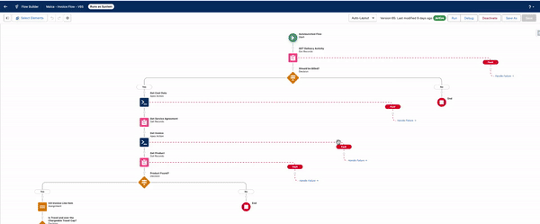

# Billing Invoice Generation

## Overview

The following article details **Maica's** Invoice Generation Logic. It provides further insight in understanding how the Billing lifecycle works within **Maica**.&#x20;

The Billing Engine in Maica is powered by the `Maica - Invoice Flow`. This flow is further detailed below.&#x20;

<figure><figcaption>
Maica's Invoice Flow
</figcaption></figure>

This flow is designed to generate an Invoice and Invoice Line Items for Delivery Activities within **Maica**. The flow retrieves the necessary data from Delivery Activities, Service Agreements, and associated Products, calculates costs based on predefined caps (e.g., travel caps), and creates Invoice Line Items.&#x20;


If any part of the process fails, the flow handles the errors by formatting and logging fault messages. Error handling is included throughout the flow to capture and log any faults that occur during processing.&#x20;


Below are all the stages and logic of the `Maica - Invoice Flow`.&#x20;

***

1. **Start (Auto-Launched Flow)**:
   * **Description**: The flow is automatically triggered and begins by retrieving the details of a Delivery Activity.
2. **Get Delivery Activity (Record Lookup)**:
   * **Description**: This lookup retrieves the `Delivery_Activity__c` record using the provided `recordId`. The flow fetches this data from the database, looking for any activity matching the input `recordId`.
   * **Next Step**: The flow checks whether the activity is billable using the `Should be Billed?` decision.
3. **Should be Billed? (Decision)**:
   * **Description**: This decision evaluates whether the delivery activity should be billed. It checks if:
     * The `Billing_Status__c` is set to `Requested`.
     * An `Invoice_Line_Item__c` has not already been created for this activity.
   * **Next Step**: If these conditions are satisfied, the flow proceeds to retrieve cost data using `Get_Cost_Data`.
4. **Get Cost Data (Apex Action)**:
   * **Description**: The flow invokes the `DeliveryCostCalculationInvocable` Apex class, which calculates the cost of the Delivery Activity based on the Service Agreement, Price Lists, and Support Items.
   * **Inputs**:
     * `recordId`: The ID of the Delivery Activity is passed to the Apex action to identify the relevant data for the cost calculation.
   * **Outputs**:
     * The Apex action returns a set of key data, including:
       * `agreementItem`: The specific Agreement Item tied to this activity.
       * `unitPrice`: The calculated unit price for the Service.
       * `quantity`: The quantity of units to bill for.
   * **Next Step**: Once the cost data is retrieved, the flow looks up the Service Agreement.
5. **Get Service Agreement (Record Lookup)**:
   * **Description**: This lookup fetches the `Service_Agreement__c` associated with the Delivery Activity’s Agreement Item. The flow uses the `agreementItem.Service_Agreement__c` ID obtained from the cost data.
   * **Next Step**: After retrieving the Service Agreement, the flow proceeds to generate or retrieve an Invoice.
6. **Get Invoice (Apex Action)**:
   * **Description**: This Apex action (`GetInvoiceInvocable`) either retrieves an existing Invoice or creates a new one based on the input parameters. This step ensures that any subsequent billing actions are tied to the correct Invoice for the participant and service provider.
   * **Inputs**:
     * `fundingType`: Derived from the Service Agreement’s `Funding_Type__c`.
     * `participantId`: Fetched from the Delivery Activity’s `Participant__c`.
     * `serviceProviderStr`: The `Service_Provider__c` linked to the Service Agreement.
   * **Outputs**:
     * The result of this action is the `Invoice__c` record, which is stored in the flow’s `invoice` variable.
   * **Next Step**: The flow proceeds to retrieve the associated Product for the Invoice Line Item.
7. **Get Product (Record Lookup)**:
   * **Description**: This step looks up the `Product2` record related to the Support Item being billed. The flow uses the `Support_Item__c` from the cost data’s `agreementItem` to identify the product.
   * **Validation**:
     * The lookup ensures that the `Product2` record is valid for billing by checking:
       * The product exists in the database and is not null.
       * The `Support_Item__c` field correctly matches a product ID, ensuring the right product is billed for the Delivery Activity.
   * **Next Step**: Once the product is validated, the flow checks if the product is found using the `Product Found?` decision.
8. **Product Found? (Decision)**:
   * **Description**: This decision ensures that a valid `Product2` record was retrieved in the previous step. The flow checks if:
     * The Product ID is not null (`Get_Product.Id` is set).
     * The Product exists in the system.
   * **Next Step**: If the Product is found, the flow moves to initialise the Invoice Line Item.
9. **Initalise Invoice Line Item (Assignment)**:
   * **Description**: In this step, the flow initialises the `Invoice_Line_Item__c` record by assigning values for several key fields, including:
     * `Product__c`: The ID of the retrieved Product (`Get_Product.Id`).
     * `Invoice__c`: The ID of the Invoice created or retrieved in the previous step.
     * `Agreement_Item__c`: The Agreement Item ID from the cost data.
     * `Claim_Type__c`: The claim type from the Delivery Activity.
     * `Unit_Price__c`: The unit price obtained from the cost calculation.
     * `Quantity__c`: The quantity calculated from the cost data.
     * `Service_Date__c`: The service date from the Delivery Activity.
     * `Status__c`: Set to `Entered`.
   * **Next Step**: The flow evaluates whether the travel caps need to be applied.
10. **Is Travel over the Chargeable Travel Cap? (Decision)**:
    * **Description**: This decision checks whether the Delivery Activity is non-time-based (`Non_Time_Based_Activity__c`) and whether the `Quantity__c` exceeds the `TravelCapKms`. This ensures that the travel charges are capped at a certain limit based on kilometres.
    * **How TravelCapKms is Determined**:
      * The flow checks if the `Chargeable_Travel_Cap__c` field from the `agreementItem` is greater than 0. If so, this value is used as the `TravelCapKms`.
      * If the `agreementItem` does not have a specific travel cap, the flow falls back to the system-wide travel cap.
      * If neither the agreement-specific nor system-wide caps are set, the travel cap defaults to 0, meaning no travel charges are allowed.
    * **Next Step**: If the quantity exceeds the travel cap, the flow moves to adjust the quantity.
11. **Set Maximum (Assignment)**:
    * **Description**: Adjusts the `Quantity__c` of the Invoice Line Item to fit within the allowed `TravelCapKms`. This step ensures that the Invoice Line Item does not exceed the allowable limit for travel-related charges.
    * The `Quantity__c` of the Invoice Line Item is set to the calculated value of `TravelCapKms` (derived from either the Service Agreement or system settings).
12. **Is Travel over the Time Travel Cap? (Decision)**:
    * **Description**: This decision checks whether the delivery activity is time-based (`Time_Based_Activity__c`) and whether the `Quantity__c` exceeds the `TravelCapHours`. It ensures that time-based travel charges are capped at a certain limit.
    * **How TravelCapHours is Determined**:
      * Similar to the `TravelCapKms`, the flow first checks the `Time_Travel_Cap__c` field in the `agreementItem`. If set, this value is used as the maximum allowable time-based travel.
      * If the `agreementItem.Time_Travel_Cap__c` is not set, the flow checks the system-wide setting.
      * If no time travel caps are specified in either the agreement or system-wide settings, the time-based travel cap defaults to 0, meaning no time-based travel charges are allowed.
13. **Set Maximum (Assignment)**:
    * **Description**: Adjusts the `Quantity__c` of the Invoice Line Item to fit within the allowed `TravelCapHours`. This prevents overcharging for time-based travel activities.
    * The `Quantity__c` of the Invoice Line Item is set to the calculated value of `TravelCapHours`, which is derived from the Service Agreement or system-wide settings.
14. **Create Invoice Line Item (Record Create)**:
    * **Description**: This step creates the `Invoice_Line_Item__c` record using the data assigned earlier. The flow saves the line item and links it to the relevant Invoice and Product.
15. **Update Delivery Activity (Record Update)**:
    * **Description**: The Delivery Activity is updated with the relevant details, including:
      * The `Agreement_Item__c` linked to the Service Agreement.
      * The `Billing_Status__c`, which is set to `Generated`, indicating that the billing process has been completed.
      * The newly created Invoice Line Item is linked to the Delivery Activity.
16. The flow completes the process of generating the Invoice and updating the related records.

***

#### Flow Summary

This flow automates the generation of Invoices and Invoice Line Items for Delivery Activities within **Maica**. It ensures that invoices are accurately created based on the Service Agreements and predefined caps for travel and time-based activities. Error handling is included throughout the flow to capture and log any issues during processing.
