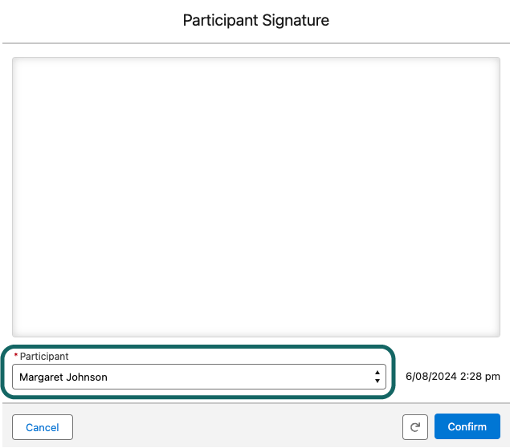

# Participant Signatures

## How do I record a Participant(s) Signature?

To begin recording a Participant(s) signature, simply open an [Appointment](../../getting-started/maica-key-concepts/appointment.md) and then click the `Signature` button at the bottom of the screen to bring up the dialogue box. Once selected, you can record signatures against an [Appointment](../../getting-started/maica-key-concepts/appointment.md). On a desktop, you do so by manually moving the mouse in the display box, whilst on mobile this will include the ability to simply write on the screen.&#x20;

If you have multiple [Participant(s)](../../getting-started/maica-key-concepts/participant.md) in a single [Appointment](../../getting-started/maica-key-concepts/appointment.md), you must choose which [Participant](../../getting-started/maica-key-concepts/participant.md) the signature applies to. All [Participant(s)](../../getting-started/maica-key-concepts/participant.md) within the [Appointment](../../getting-started/maica-key-concepts/appointment.md) will display in the dropdown list highlighted below.&#x20;

<figure><figcaption>
Capturing Participant Signature
</figcaption></figure>
