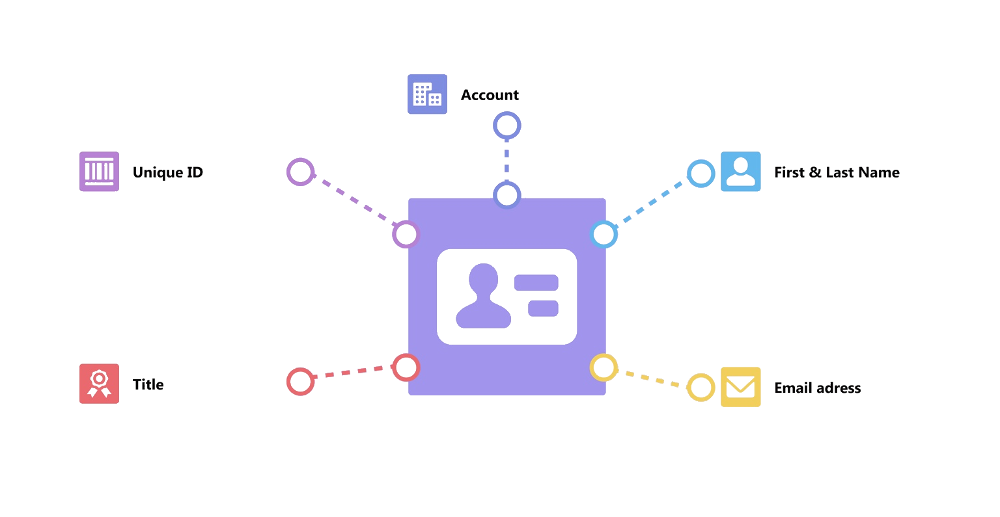

# Salesforce Key Concepts

Maica has been developed on the Salesforce platform so becoming familiar with this technology will be essential to understanding Maica.  We have summarised the key learnings, functions, and features ot be award of so everything is in a single easy-to-access place for you.&#x20;

### The Basics

Salesforce is a powerful cloud-based platform that helps businesses manage their relationships with customers. It offers tools and applications for sales, customer service, marketing, and more, all in one place. Think of Salesforce as a digital assistant that organizes and tracks interactions with customers, whether it’s through emails, phone calls, or social media. This helps businesses understand their customers better, provide better service, and ultimately grow their business. Because it’s cloud-based, all of this can be accessed from anywhere with an internet connection, making it incredibly versatile and convenient for companies of all sizes.

<figure><figcaption>
The Salesforce Homepage
</figcaption></figure>


You can learn more about the Salesforce platform [here](your-maica-learning-path.md).


### The Person Account Architecture

Salesforce Person Accounts is a feature designed to help businesses manage relationships with individual customers, not just companies. In simple terms, think of it as a way to store and organize all the information about a person, like their contact details, preferences, and interactions, in one place.&#x20;

Normally, Salesforce separates people (Contacts) and companies (Accounts) into different records, but Person Accounts combine these two into one. This makes it easier for businesses to handle all the information about a person, whether they’re interacting as an individual or on behalf of a company.&#x20;


The `Person Account` architecture is Salesforce's best-practise approach to managing people and organisations most effectively. All of Salesforce's inductry cloulds are built on this architecture with which Maica is **fully compatible.**


It’s particularly useful for industries like healthcare, retail or financial services, where customer relationships often revolve around individuals rather than businesses.

<figure><figcaption>
The Salesforce Person Account Model
</figcaption></figure>

You can learn more about Salesforce's Person Account architecture [here](https://help.salesforce.com/s/articleView?id=sf.account_person.htm\&language=en_US\&type=5).&#x20;


Maica is fully compliant with Salesforce's Person Account architecture which gives you access to all of Salesforce's industry clouds, including:

* [Salesforce Health Cloud](https://www.salesforce.com/au/products/health-cloud/overview/)
* [Salesforce Nonprofit Cloud](https://www.salesforce.com/nonprofit/cloud/)
* [Salesforce Service Cloud](https://www.salesforce.com/au/service/cloud/)


### Data Objects and Attributes

In Salesforce, data is organised into structures called “objects,” which are similar to tables in a database. There are two main types of objects: Standard Objects and Custom Objects. Standard Objects are built-in features of Salesforce, like Accounts, Contacts, Leads, and Opportunities. These represent common business data and come with predefined fields. For instance, the Account object might include fields for the company’s name, industry, and contact information. Custom Objects, on the other hand, are created by users to store information specific to their business needs. For example, a company might create a Custom Object to track employee training or project details.

Each object consists of “fields,” which are like columns in a table. Fields hold the data for individual entries, called “records.” For instance, in the Contact object, you might find fields for First Name, Last Name, Email, and Phone Number. Salesforce allows users to customize these fields or create new ones to capture specific information. Fields can also have different types, such as text, date, number, or picklist (a dropdown menu with predefined options). This architecture is flexible, allowing businesses to tailor Salesforce to fit their unique data requirements and ensure that the system aligns with their specific workflows and processes.

### User Interface Navigation

Navigating Salesforce is designed to be user-friendly, with a focus on helping users quickly access the information they need. At the core of this navigation are “Apps,” which are collections of objects, tabs, and other functionalities tailored to specific business processes. For example, the Sales app might include objects like Accounts, Contacts, Opportunities, and Leads, while the Service app could focus on Cases and Knowledge articles. Users can switch between apps using the App Launcher, usually found in the top left corner, which provides a dropdown menu to select from the available apps. This setup helps users stay organized and focused on their specific roles and tasks.

Within each app, data is presented in “List Views” and “Detail Pages.” List Views display records in a table format, making it easy to see multiple entries at once. These views can be customized to show specific fields and filters, allowing users to quickly find the records that are most relevant to them. For instance, a sales rep might use a List View to see all open Opportunities sorted by closing date. Clicking on a record in a List View takes the user to the Detail Page for that record, where they can see all the associated information and related lists, such as activities, attachments, and notes. The Detail Page is a comprehensive view of a single record, providing all the details in one place.


You can learn more about the Salesforce platform [here](your-maica-learning-path.md).

