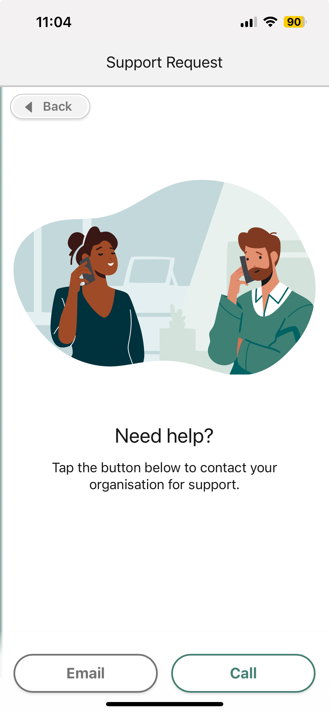

# Home Page Overview

## Home Screen Overview

When you first log in to the **Maica Mobile Care Worker App**, you’ll land on the **Home screen**. This is your starting point for the day, showing your upcoming schedule, a quick summary of hours and appointments, and shortcuts to useful tools. Think of it as your dashboard — everything you need at a glance.


### Salesforce vs Maica Functions

Before we dive into the details, it’s important to know that some of what you see on this screen comes from **Salesforce**, and the rest comes from **Maica**.

* In the **top bar**, the profile icon (top left), and the three icons on the top right (Share, Search, Notifications) are Salesforce functions, as well as the App Launcher and All Items section in the bottom Menu. These aren’t part of Maica. If you need help with those, please check Salesforce’s own documentation.
* Everything else — your weekly summary, appointment list, filters, and quick action buttons — is part of the Maica app. That’s what we’ll focus on here.



### A Note on Permissions

The actions and features you see in your app are defined by your organisation. This means some buttons may or may not be visible to you.

* For **Care Workers**: If you don’t see an option, or you can’t access something described here, it’s because it has not been enabled or your organisation may not use it. It is not a bug.&#x20;
* For **Organisation Admins**: To learn how to set and determine these permissions, please refer to the [**Permission Sets**](https://app.gitbook.com/s/9selzjEx6KX7RYEawAVr/data/permission-groups-and-sets/permission-set-groups-overview) article in the Admin Guide.

Please note, this guide is designed to describe the application as if all Permissions have been enabled.&#x20;


## Page Elements&#x20;

Now, let’s walk through the Home screen from top to bottom. In the graphic, each part of the screen will be numbered.&#x20;

<figure><figcaption></figcaption></figure>

These elements are each further detailed in the table below:

<table><thead><tr><th width="62.87109375">#</th><th width="204.54296875">Element</th><th>Description</th></tr></thead><tbody><tr><td>1</td><td><strong>Profile Icon</strong></td><td>Opens your Salesforce profile settings. Managed by Salesforce.</td></tr><tr><td>2</td><td><strong>Salesforce Tools</strong></td><td>Share, Search, and Notifications. Managed by Salesforce.</td></tr><tr><td>3</td><td><strong>Filter</strong></td><td>Refine which appointments/shifts are shown in your schedule.</td></tr><tr><td>4</td><td><strong>Calendar Navigation</strong></td><td>Move backward/forward through your schedule.</td></tr><tr><td>5</td><td><strong>Add (+)</strong></td><td>Create a new record (only available if your organisation enables this).</td></tr><tr><td>6</td><td><strong>Refresh</strong></td><td>Reloads the page to show the latest data.</td></tr><tr><td>7</td><td><strong>Period Selector</strong></td><td>Switch between <strong>Day</strong>, <strong>Week</strong>, or <strong>Month</strong>.   The period also controls the wording on the summary card (e.g., “<strong>This Week</strong>”, “<strong>This Month</strong>”).</td></tr><tr><td>8</td><td><strong>My Offers</strong></td><td>Shows <em>Pending</em> and <em>Accepted</em> Shift/Appointment Offers. To learn more about the My Offers component, <a href="my-offers.md">click here</a>. </td></tr><tr><td>9</td><td><strong>Actions Dropdown (⚡)</strong></td><td>Opens <strong>Home Screen Actions</strong>. <em>See the section below for details.</em></td></tr><tr><td>10</td><td><strong>Support</strong></td><td>Opens a Support screen so Care Workers can directly contact your organisation via Phone or Email from within the Maica App. <em>See the section below for details.</em></td></tr><tr><td>11</td><td><strong>Summary Card</strong></td><td>Shows total <strong>Appointments</strong> and <strong>Hours</strong> for the currently selected period. You can <strong>expand/collapse</strong> it with the chevron and <strong>swipe</strong> across the card to move between periods.</td></tr><tr><td>12</td><td><strong>Appointments &#x26; Shifts List</strong></td><td>Your appointments/shifts for the selected period, including time, participant, and location. Tap an item to open its details.  To learn more above Appointment &#x26; Shifts, <a href="appointments-and-shifts-overview.md">click here</a>. </td></tr><tr><td>13</td><td><strong>Schedule Legend Toggle</strong></td><td>The small <strong>chevron</strong> at the bottom of the screen. Tap to reveal the colour/status legend for your schedule; tap again to hide.</td></tr><tr><td>14</td><td><strong>Bottom Navigation</strong></td><td>Switch between <strong>Home</strong> and the <strong>Menu</strong>.</td></tr></tbody></table>


The summary card automatically changes depending on the period you select. If you’re viewing a month, it will say “This Month.” If you’re viewing a week, it will say “This Week.”\
\
Additionally, you can swipe left or right on the summary card to quickly move between periods.


## Home Screen Actions

To the right of the welcome message, you’ll see the **⚡ Actions** button (tagged as 9 above). These shortcuts help you do common tasks without leaving Home. Each of these actions are further described below.&#x20;


**Note:** The features and actions vary by organisation.&#x20;


#### Manage Unavailability

Record times when you aren’t available to work.

* Choose the relevant date/time range (single or multi-day).
* Add a short description if needed (e.g., “Annual leave”).
* Save to update your availability so your organisation can plan around it.


For more information on how Unavailability works within Maica, [click here](../the-planner/planner-actions/manage-unavailability.md).&#x20;


#### New Participant Note

Create a quick note against a Participant—useful for brief updates or context.

* Pick the **Participant**, enter your **note**, and **save**.
* The note is stored on the Participant record for your team to view.


For more on Notes, see the [Participant Notes article](appointments-and-shifts-actions/notes.md) in the User Guide.


#### Show Google Maps

Open a route in **Google Maps** for the appointments/shifts in your **current period**.

* If your **period** is set to **Day**, you’ll see a route for **today’s** visits.
* If you’re on **Week/Month**, you’ll get a route reflecting that wider period (we recommend **Day** for practical navigation).


The route opens in your device’s Google Maps app.


The continue learning about the Mobile Worker App, please continue to the [**Appointments & Shifts Overview**](appointments-and-shifts-overview.md).

#### Support&#x20;


Please note, Support does not sit within the Actions dropdown, but on the Home Screen is located to the left of it, [as shown above](home-page-overview.md#page-elements) by **tag 10**. \
\
On Appointment or Shift screens, it is also visible to the right of the Refresh button, as shown below.&#x20;


If you need assistance, you can contact your organisation directly from the **Support** screen in the Maica Mobile App show below.&#x20;

<figure><figcaption></figcaption></figure>

You can,&#x20;

* Tap **Email** to send your support request via email.
* Tap **Call** to speak with your organisation immediately.


As an organisation, the Phone and Email fields in the Maica General Settings must be populated for this to be visible. In addition, the Permission Set `Maica - Planner - Support Available` needs to be assigned.&#x20;


As mentioned, on an Appointment or Shift screen, the Support button will be visible to the right of the Refresh button, as shown below.

<figure><figcaption></figcaption></figure>

