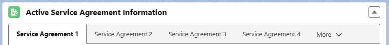

# Participant Profile

## Participant Profile Overview&#x20;

In **Maica**, `Participants` are managed as Salesforce `Contact` Records.&#x20;


If you are looking for an overview of how `Contacts` work in Salesforce, [Trailhead](https://trailhead.salesforce.com/content/learn/modules/accounts_contacts_lightning_experience/accounts-and-contacts-lightning) has a number of great learning resources, including hands-on challenges and modules.


`Contact` records are the place where you capture and manage attributes and information of your `Participants`, including:

* Personal Information (i.e. Name)
* Contact Information (i.e. Phone and Email)
* Address Information
* Demographic Information (i.e. Birthdate, Age, Primary Language)
* NDIS Number (NDIS only)&#x20;
* Communication Preferences
* [Funding Records](ndis-funding/funding-record-overview.md)&#x20;
* [Payment Methods](../../invoices/invoice-actions/process-an-invoice.md)
* [Active Schedule](./#active-schedule)
* [Upcoming Schedule](./#upcoming-schedule)

## Participant Record Summary Components

The Participant Record includes handy Summary Components containing key information about the Participants `Funding` , `Service Bookings` , `Service Agreements` and `Schedule`. These components are:&#x20;


Note, `Service Booking` components are only for non-PACE NDIS Participants.&#x20;


### Funding Summary Component&#x20;

This component summarises crucial information from the Participant's `Funding` right on the Contact record. This means you will not have to sift through associated documents to receive a quick, at-a-glance summary of the Participant's `Funding` information. It is located on the right hand side of the record under the `Funding Information` tab.&#x20;

<figure><figcaption></figcaption></figure>

### Service Booking Summary Component&#x20;

Similar to the `Funding` component, this component summarises the key period and budget information for any **active** `Service Booking` records associated with the `Participant`. This will only be relevant for your non-PACE NDIS Participants.&#x20;

<figure><figcaption></figcaption></figure>


This component is hidden if the Participant has no **active** record(s)


### Active Service Agreement Summary Component

Similar to the above components, this component summarises the key period and budget information for any **active** `Service Agreements` records associated with the `Participant`. This component will show you information around each Agreements Approved Amounts, Remaining Amounts, Utilised Amounts and End Date.&#x20;

These fields are calculated by the following:&#x20;

* Agreement Approved Amount: `maica_cc__Service_Agreement__c`.`maica_cc__Approved_Amount__c`
* Agreement Utilised Amount: `maica_cc__Service_Agreement__c`.`maica_cc__Utilised_Amount__c`
* Agreement Remaining Amount: `maica_cc__Service_Agreement__c`.`maica_cc__Remaining_Amount__c`
* Agreement End Date: `maica_cc__Service_Agreement__c`.`maica_cc__End_Date__c`

<figure><figcaption></figcaption></figure>

If a `Participant` has multiple `Service Agreements`, you will be able to switch between them on the Summary Component through tabs, as shown below.&#x20;

<figure><figcaption></figcaption></figure>

Each tab will display the same fields listed above for each individual Agreement.


For more information on how `Funding` is managed in **Maica**, please go [here](ndis-funding/) for NDIS Funding and [here](home-care-package-funding.md) for Home Care Package funding.


### Active Schedule

The **Active Schedule** component provides visibility into all active **Recurring Appointment Schedules** linked to a **Participant**.&#x20;

This component displays key scheduling information to help users understand the current structure of recurring appointments at a glance.

Each record in the Active Schedule list includes:

* `Schedule ID`
* `Schedule Start Date`
* `Schedule End Date`
* `Frequency`
* `Interval`
* `Appointment Service(s)`
* `Next Appointment Date` (linked to the Appointment record)
* `Type`


Please note, only **Schedule** records that meet all of the following conditions appear:

* `Under Evaluation = TRUE`
* The related **Master Appointment** is not cancelled
* The **Master Appointment** has a valid Record Type


Records are sorted in **ascending order by Schedule Start Date** for clarity. A scroll bar is provided for large lists, with placeholder text shown when no schedules match the criteria.

The component will display as shown below:&#x20;

<figure><figcaption></figcaption></figure>

### Upcoming Schedule

The **Upcoming Appointments** section provides a clear, paginated list of a Participant’s scheduled **Appointments**. It allows you to quickly review upcoming services, with filtering options to improve visibility and management.

This list is especially useful for seeing future commitments at a glance without navigating into the Planner.&#x20;

Appointments are displayed in pages of up to 10 records at a time, with scrolling available to access more. The list includes key details such as:

* **Scheduled Start Date/Time** (recurring icons are shown for repeating Appointments)
* **Status** of the Appointment
* **Duration** in minutes
* **Ratio**

Each record can be expanded to show further information, including the **Resource(s)** delivering the service, the **Service(s)** attached, the **Appointment Address**, and a link for directions that opens directly in Google Maps.

Additionally, to help you focus on the most relevant information, you can filter the list by **Status** or by a specific **time frame**. Available time frames include:

* Today
* Tomorrow
* This Week
* Next Week
* Next Two Weeks (Fortnight)
* This Month
* All


For optimal Maica performance, a maximum of 1,000 future Appointments can be displayed for a single Participant.



Appointment records are accessible via the **Scheduled Start Date** link.


## Participant Record Related Lists

The Participant Record also includes handy Related Lists containing key information about the Participants. The key lists are further detailed below:

### Connections&#x20;

The Connections List allows you to define relationships between Contacts. This could include both personal relationships as well as any other form of connection between people.

The easiest way to access `Connections` is via the `Participant Profile` under `Related`.


`Connections` can be found under `Related` by default, however your team can change where this appears by customising your [Salesforce Page Layouts](https://help.salesforce.com/s/articleView?id=customize_layout.htm\&language=en_US\&type=5).


Before detailing how Connections function in further detail, here are some things you should know about this feature:

* `Connections` are reciprocal. Meaning, **Maica** will create a corresponding `Connection` for both Contacts.&#x20;
* You can create your own `Connection` types beyond what **Maica** offers out of the box within the Connection Settings.&#x20;

Now, please refer below to see what a typical `Connection` record will look like in **Maica**.&#x20;

<figure><figcaption></figcaption></figure>

&#x20;In order to create a new `Connection`, simply click the `New` button and complete the following fields:

* **Contact**: **Maica** auto-populates this field with the name of the Contact the `Connection` record is connected to.
* **Related Contact**: Specifies the Contact who's related to the person in the Contact field.
* **Type**: Specifies how the Related Contact is connected to the Contact. In the below example, Andrew Milne is Luca Milne's parent.
* **Status**: Specifies whether this is a current or former `Connection`.

Once these fields have been populated, a few additional options are available for you to record, including:

* **Primary Contact**: When this option is selected, Maica will display the Related Contact on the `Participant` profile for ease of access to critical information. We have shown you a sample of this at the bottom of this article.
* **Next of Kin**: Specifies that the Related Contact is the `Next of Kin` for the Contact.
* **Description**: A place to add additional information about the `Connection`.
* **Statement Recipient**: Specifies that the Related Contact is the recipient of the Statement.
* **Invoice Recipient**: Specifies that the Related Contact is the recipient of the Invoice for self managed Service Agreements.

Once done, your `Connection` record will be saved within the Profile of both `Contacts`.&#x20;

### Participant Resources

The `Participant Resource` related list allows for the management of Resources being assigned to Participants. It is located under `Client Care` tab.

The benefit of this list is to be able to see which `Participants` are associated with which `Resources`, as shown below. This is particularly useful if a `Participant` is associated with multiple `Resources`.

<figure><figcaption></figcaption></figure>

To link a Participant with a Resource, simply click `New`, select the desired `Resource` from the dropdown, nominate a Date Range, and `Save`.


The `Participant Resource` list is directly related to the `Resources Participant` list on the [Resource Profile](../../resources/resource-profile.md). This means, if multiple `Participants` are receiving care from a given `Resource`, this will be reflect on the `Resource Participants` list and display on the [Resource Profile](../../resources/resource-profile.md) under the Profile Management tab. This list will be dynamically updated if an update occurs on the `Resource` Profile.


### Participant Goals

The `Participant Goal` related list allows for the management of Goals being assigned to Participants.&#x20;

The benefit of this list is to be able to track and manage the Goals associated with each Participant, including their progress over time. This is particularly useful when a Participant has multiple Goals at different stages.

To create a new Participant Goal, simply click **New**, complete the required fields:&#x20;

* Goal Name: Enter a custom Goal Name for your Participant&#x20;
* Contact: **Maica** auto-populates this field with the name of the Contact the `Connection` record is connected to.
* Goal: Associate a Goal or create a new one to assign to the selected Participant&#x20;
* Start Date

As well as any optional fields such as:

* End Date
* Stage: Choose between Definition, In Progress, Partially Achieved, Fully Achieved or Not Achieved. &#x20;
* Description

Once done, simply click **Save**.


**Archiving Participant Goals**\
\
The **Archived** checkbox allows Goals to be marked as inactive once they are complete, expired, or no longer relevant. Archived Goals are excluded from all lookup fields and will not appear when linking Goals in other forms such as Participant Notes or Appointment completion flows. Only active (non-archived) Goals remain available for selection.


Below are some example scenarios of how Participant Goals will behave in Maica:&#x20;

| Scenario                                                   | Behaviour                                                                      |
| ---------------------------------------------------------- | ------------------------------------------------------------------------------ |
| A Participant has multiple historic Goals                  | ✅ Only active (non-archived) Goals are shown in lookup fields.                 |
| A Maica user tries to add a Goal to a new Participant Note | ✅ Archived Goals are not displayed, ensuring only current Goals can be linked. |
| A Maica user marks a Goal as archived                      | ✅ The Goal is no longer visible in lookup fields across the system.            |

## Participant Record Automated Geographical Classification

Maica includes an automated process to populate key geographical classification fields on the `Participant Record` using **Mailing Postal Code** and **Mailing City**. This ensures accurate regional classification without manual input, streamlining data entry and improving reporting accuracy.

When a `Participants` **Mailing Postal Code** and **Mailing City** are provided, Maica automatically matches these values against a **Postcode record** to populate the following fields on the `Participant Record`:

#### Fields Populated on the Participant Profile:

* **MMM Classification** (`maica_cc__MMM_Classification__c`)
* **PHN (Primary Health Network)** (`maica_cc__PHN__c`)
* **LGA (Local Government Area)** (`maica_cc__LGA__c`)

#### For example:&#x20;

#### 1. User enters the following on a **Participant** record:

* Mailing Postal Code: **3184**
* Mailing City: **Elwood**

#### 2. Maica searches for a **Postcode record** where:

```
Postcode Suburb Key = 3184Elwood
```

#### 3. A match is found in the Postcode object with the following details:

* **LGA:** Port Phillip
* **PHN:** South Eastern Melbourne
* **MMM Classification:** 1

#### 4. Participant record is updated automatically with the above details


Please note:&#x20;

* If you **modify** the **Mailing City** or **Mailing Postal Code** to values that do not correspond to a Postcode record, Maica **clears** the LGA, PHN, and MMM Classification fields.
* You **cannot manually edit** these fields, ensuring consistency and preventing incorrect classifications.



The [Modified Monash Model (MMM)](https://www.health.gov.au/health-topics/rural-health-workforce/classifications/mmm) defines whether a location is a city, rural, remote or very remote.


