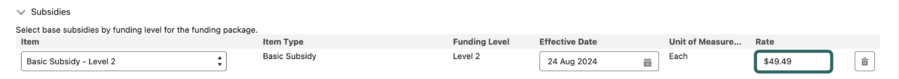
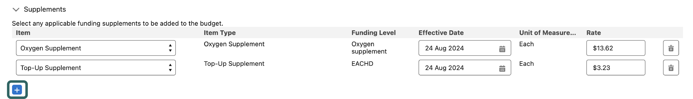

# Manage Budget


Please note, as of November 1st 2025 Home Care Packages are being replaced with Support at Home funding, as result, this function of Maica will be rendered obsolete.&#x20;


## What does the `Manage Budget` Quick Action do?

The Manage Budget tool in **Maica** is a Quick Action with a customised User Interface for generating, updating, and managing a Home Care Package budget. `Manage Budget` allows you to create and generate a new Budget against a Service Agreement, or manage and make changes to an existing Package Budget for your Aged Care Participants.&#x20;

## Where do I find the `Manage Budget` button?

The Manage Budget function is visible at the top right hand corner of your interface on the Service Agreement record, as shown below.&#x20;

<figure><figcaption></figcaption></figure>


This function is only available when the `Funding Type` is set to `Home Care Package`.&#x20;


## How do I configure my Budget?&#x20;

In order to begin setting up your Home Care Package Budget, simply click the `Manage Budget` button to display the pop-up, as shown below. &#x20;

<figure><figcaption></figcaption></figure>

The Manage Budget tool is divided into individual sections that are used to set up the various components of a Home Care Package Budget. These include:&#x20;

1. [Subsidies](manage-budget.md#id-1.-subsidies)&#x20;
2. [Supplements](manage-budget.md#id-2.-supplements)&#x20;
3. [Claimable Fees](manage-budget.md#id-3.-claimable-fees)
4. [Billable Fees](manage-budget.md#id-4.-billable-fees)&#x20;
5. [Client Contributions](manage-budget.md#id-5.-client-contributions)&#x20;
6. [Budget Summary](manage-budget.md#id-6.-budget-summary)&#x20;

Before commencing with populating the above sections, always begin by selecting the `Date` from which the Service Delivery will commence. For a new Budget, this will always default to the `Current Date`.


To learn more about each component, please see our Home Care Package Building Blocks page [here](/broken/pages/JxfvlqI2eruwuASsXVj9).


### 1. Subsidies

The first step is to set up the Base Subsidy Level.


You cannot select any of the budget's other components until you have completed this step. If the customer has not received package-level funding, you cannot proceed with creating their budget.


Once you select the Base Subsidy Level, the rate for that Subsidy Level is obtained from the Price List and automatically populated. The Effective Date (the date in which the funding becomes applicable) will also be automatically populated to the Current Date. You can set the Effective Date to either the future or the past. This is useful if the package has not yet been started, or if it is already running.

For example, when a Basic Subsidy - Level 2 was selected, a rate of $49.49 was retrieved and assigned from the Price List, as shown below.&#x20;

<figure><figcaption></figcaption></figure>


It is also possible to override the Price List rate if you desire to personalise your rates or use a different calculation method.


Once the Subsidy has been selected, you can begin to select the other budget components.&#x20;

### 2. Supplements

Moving on to the second component, it is here you will be able to select Supplements. The dropdown will show any configured Supplement [Support Items](../../the-building-blocks.md#support-items) that will be available for selection and to add into your Budget. Similar to the Subsidies, the rate for any Supplement is obtained from the Price List and automatically populated and added to your Budget.&#x20;

You can add any number of Supplements by simply clicking the `Blue +` button under the header, as shown below.

<figure><figcaption></figcaption></figure>

### 3. Claimable Fees

The next component of the `Manage Budget` tool is Claimable Fees. These are fees that the provider can claim on behalf of the Home Care Package from the Government.&#x20;


These are essential components of **Maica** invoicing. **Maica** will reference any Claimable Fees and construct Invoice Line Items that are ready to be claimed. To learn more, click [here](https://app.gitbook.com/s/9selzjEx6KX7RYEawAVr/data/data-objects/invoice#flows).&#x20;


Again, the rate for any Claimable Fee is obtained from the Price List, automatically populated, and added to your Budget.&#x20;

### 4. Billable Fees

The next component of the `Manage Budget` tool is Billable Fees. These are fees that are charged directly to a customer through a co-payment invoice. These fees are usually means tested and are hence an individual rate per participant. As a result, **Maica** sets the default rate for Billable Fees to $0, and you can input the specific required rate against the package.

### 5. Client Contributions&#x20;

The next component of the `Manage Budget` tool is Client Contributions. These are contributions into the Budget made directly by the Client. Here you can also set up a one-time or regular payment into a Client's Budget to make certain they have adequate funds to procure certain Items or receive additional Services. Similar to Billable Fees, **Maica** sets the default rate for Client Contributions to $0 and you can input the specific required rate against the package.

### 6. Budget Summary

After you have completed all of the Budget's sections, you can refer to the Summary to receive an overview of your Home Care Package Budget. As shown below.&#x20;

<figure><figcaption></figcaption></figure>

This includes a Summary of the Total Budget Value, Total Claimable Fees and Total Billable Fees.&#x20;


Please note that these Summary values are based on the Budget Value on a Daily Basis.&#x20;


Once you are ready, click the blue `Submit` button in the bottom right hand corner of the pop-up to save your Budget.&#x20;

## What happens after I have completed my Budget?&#x20;

After you have submitted your Budget, the first thing Maica will do is output a Plan Record that is located in the [Home Care Agreement](./#home-care-agreement) section of the Service Agreement Record. The Plan Record essentially represents the Budget, which includes individual Plan Budgets for each line item selected in the `Manage Budget` tool. &#x20;

If you manage or change your Budget, this will be updated and represented in the Plan Record.&#x20;

**Maica** will also automatically populate the Budget Trend Analysis in order to assist you in monitoring and forecasting a Participant's financial status, and helping to manage and adjust Home Care Package Budgets effectively over time.

<figure><figcaption></figcaption></figure>
