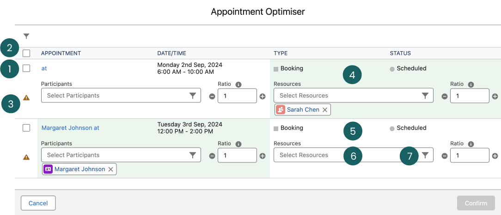

# Appointment Optimiser


The Appointment Optimiser may be called the Shift Optimiser depending on what View you are in the Maica Planner. It is the same tool, but can be used for both Appointments or Shifts. All logic discussed in this article in relation to Appointments, also applies to Shifts.&#x20;


## What is the Appointment Optimiser?&#x20;

The Appointment Optimiser is a tool accessible from the Maica Planner that assists in filling any unfilled Appointments efficiently.&#x20;


An unfilled Appointment is any Appointment where the specified number of Resources or Participants does not match the allocated number determined by the Ratio.&#x20;


The Appointment Optimiser enables for the quick filling of unfilled Appointments, and if required, it can automatically populate Appointments with both the Participants and Resources considered most suitable by the [Smart Selection Filter](../../appointments/create-an-appointment/smart-selection-filter.md).

## Where do I find the Appointment Optimiser?&#x20;

The Appointment Optimiser is located in the Planner Menu bar, as highlighted below.&#x20;

<figure><figcaption></figcaption></figure>

## How do I use the Appointment Optimiser?&#x20;

To begin using the Appointment Optimiser, simply click the button highlighted above. After doing so, you will be presented with the Appointment Optimiser module containing every unfilled Appointment within your selected Period, in this case, a week.&#x20;

In the above screenshot, we can see there are two unfilled Appointments.&#x20;


Unfilled appointments in **Maica** are indicated on the Planner with a red outline. This is configurable; for additional information, please click [here](https://app.gitbook.com/s/9selzjEx6KX7RYEawAVr/settings/planner-management).


Once we select the Appointment Optimiser, these Appointments will be included, as shown below.&#x20;

<figure><figcaption></figcaption></figure>

There are a number of key components and ways of utilising the Appointment Optimiser and filling your Appointments from this point, these are identified through the numbers above and detailed through the table below.&#x20;

<table><thead><tr><th width="121">Number</th><th width="271">Component </th><th>Description </th></tr></thead><tbody><tr><td>1</td><td>Automatically Optimise </td><td>Selecting this checkbox will automatically populate your Appointment with the most appropriate Participant or Resource based on the top selection in the <a href="../../appointments/create-an-appointment/smart-selection-filter.md">Smart Selection Filter</a>.</td></tr><tr><td>2</td><td>Automatically Optimise All</td><td>Selecting this checkbox will automatically populate all available Appointments with the most appropriate Participant or Resource based on the top selection in the <a href="../../appointments/create-an-appointment/smart-selection-filter.md">Smart Selection Filter</a>.</td></tr><tr><td>3</td><td>Tooltip </td><td>Hovering your mouse over this tooltip alerts you whether the Appointments does not have the required Resources or Participants allocated. Once adjusted, this will display as a Green Tick. </td></tr><tr><td>4</td><td>Complete Area </td><td>The Green background indicates that there is no action required and that the allocated Resources or Participants match the required. </td></tr><tr><td>5</td><td>Area to be Optimised </td><td>The White background indicates that there is action required and that the allocated Resources or Participants do not match the required. Once adjusted, this area will display as Green. </td></tr><tr><td>6</td><td>Manually Optimise </td><td>This is a lookup field to manually add Participants or Resources to your Appointment. This is useful if you do not wish to automatically populate your Appointments. </td></tr><tr><td>7</td><td>Smart Selection Filter </td><td>This filter icon opens up the <a href="../../appointments/create-an-appointment/smart-selection-filter.md">Smart Selection Filter</a> to assist in selecting the most appropriate Participants and Resources to fill your Appointment. </td></tr></tbody></table>

Once you have filled your Appointments to match the Ratio, the Optimiser will present the Appointments in Green, as shown below. &#x20;

<figure><figcaption></figcaption></figure>

You can then simply click `Confirm` and to finalise your selections.&#x20;
